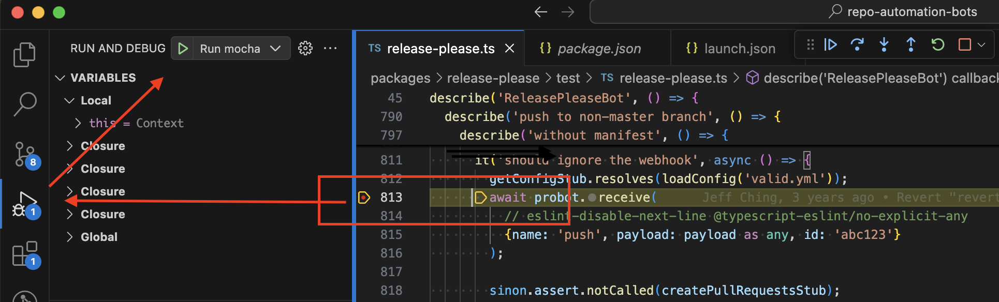

# How to become a contributor and submit your own code

**Table of contents**

* [Contributor License Agreements](#contributor-license-agreements)
* [Contributing a patch](#contributing-a-patch)
* [Running the tests](#running-the-tests)
* [Releasing the library](#releasing-the-library)

## Contributor License Agreements

We'd love to accept your sample apps and patches! Before we can take them, we
have to jump a couple of legal hurdles.

Please fill out either the individual or corporate Contributor License Agreement
(CLA).

  * If you are an individual writing original source code and you're sure you
    own the intellectual property, then you'll need to sign an [individual CLA](https://developers.google.com/open-source/cla/individual).
  * If you work for a company that wants to allow you to contribute your work,
    then you'll need to sign a [corporate CLA](https://developers.google.com/open-source/cla/corporate).

Follow either of the two links above to access the appropriate CLA and
instructions for how to sign and return it. Once we receive it, we'll be able to
accept your pull requests.

## Contributing A Patch

1.  Submit an issue describing your proposed change to the repo in question.
1.  The repo owner will respond to your issue promptly.
1.  If your proposed change is accepted, and you haven't already done so, sign a
    Contributor License Agreement (see details above).
1.  Fork the desired repo, develop and test your code changes.
1.  Ensure that your code adheres to the existing style in the code to which
    you are contributing.
1.  Ensure that your code has an appropriate set of tests which all pass.
1.  Title your pull request following [Conventional Commits](https://www.conventionalcommits.org/) styling.
1.  Submit a pull request.

### Before you begin

1.  [Select or create a Cloud Platform project][projects]. 
1.  [Set up authentication with a service account][auth] so you can access the
    API from your local workstation.


## Running the tests

1.  [Prepare your environment for Node.js setup][setup].

1.  Install dependencies:

        npm install

1.  Run the tests:

        # Run unit tests.
        npm test

        # Run a single test. E.g., for `it("does something")`
        # https://mochajs.org/#-grep-regexp-g-regexp
        npm test -- "-g" "does something"

        # Run sample integration tests.
        npm run samples-test

        # Run all system tests.
        npm run system-test

1.  Lint (and maybe fix) any changes:

        npm run fix

## Setting Break Points in VS Code

When you want to debug a test with break points in your VS Code,
take the steps below.

1. Read `package.json` of the package to understand the commands there.
   For example, in `packages/release-please/package.json`, the command for the test is
   `cross-env LOG_LEVEL=fatal c8 mocha --node-option no-experimental-fetch --exit build/test`.
   - `cross-env` is NodeJS utility command for Windows. This is irrelevant
     to break points.
   - `c8` is code coverage measurement tool. This is irrelevant to break points.
   - [mocha](https://mochajs.org/#getting-started) is the test framework
   that provides the `describe()` and `it()` methods you see in the
   tests. The steps below explains how to run Mocha via VS Code.
   - Also notice that there's `pretest` step that compiles the TypeScript
     to JavaScript.

1. In VS Code, click "Run and Debug" menu in the side bar.

1. Click "Create a launch.json file". If you already have one, then open it.

1. Add the following configuration in the `configurations` array:

   ```
        {
            "type": "node",
            "request": "launch",
            "name": "Run mocha",
            "runtimeExecutable": "mocha",
            "cwd": "${workspaceFolder}/packages/release-please",
            "args": ["--node-option", "no-experimental-fetch", "build/test"]
        },
   ```

   where `cwd` is the directory of the package you're working on and `args` is
   the list of the arguments you found in the `package.json`.

   This creates "Run mocha" option in the "Run and Debug" menu.

   - If you want to run a single test, append `-g` and `<test name>` in `args`
     ([Mocha option](https://mochajs.org/#-grep-regexp-g-regexp)).

1. Compile the package via `npm run compile`, this is the `pretest` command
   in the `package.json`. This compilation is required every time you make
   changes.

1. Add a break point in VS Code. Run "Run mocha" option via "Run and Debug" menu.
   You see your program execution stops at the line and you can inspect
   the variable values and the stack trace.



[setup]: https://cloud.google.com/nodejs/docs/setup
[projects]: https://console.cloud.google.com/project
[billing]: https://support.google.com/cloud/answer/6293499#enable-billing

[auth]: https://cloud.google.com/docs/authentication/getting-started