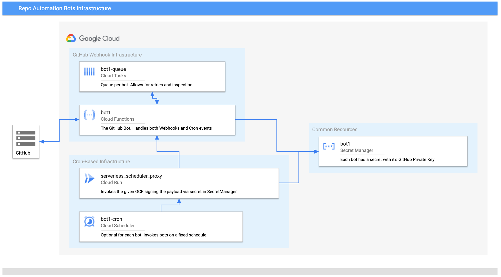

# Repo Automation Bots

A collection of bots, based on [probot](https://github.com/probot/probot), for
performing common maintenance tasks across the open-source repos managed
by Google on GitHub.

## Implemented Bots

| Name | Description | Install |
| ---- | ----------- | ------- |
| [auto-approve] | Automatically approves and merges PRs matching user-specified configs | [install][auto-approve-app] |
| [auto-label] | Automatically labels issues and PRs with product, language, or directory based labels | [install][auto-label-app] |
| [blunderbuss] | Assigns issues and PRs randomly to a specific list of users | [install][blunderbuss-app] |
| [flakybot] | Listen on PubSub queue for broken builds, and open corresponding issues | [install][flakybot-app] |
| [conventional-commit-lint] | PR checker that ensures that the commit messages follow conventionalcommits.org style | [install][conventional-commit-lint-app] |
| [do-not-merge] | PR checker that ensures the `do not merge` label is not present | [install][do-not-merge-app]
| [failurechecker] | Check for automation tasks, e.g., releases, that are in a failed state | [install][failurechecker-app] |
| [generated-files-bot] | PR checker to notify if you are modifying generated files | [install][generated-files-bot-app]
| [license-header-lint] | PR checker that ensures that source files contain valid license headers | [install][license-header-lint-app] |
| [label-sync] | Synchronize labels across organizations | [install][label-sync-app] |
| [merge-on-green] | Merge a pull-request when all required checks have passed | [install][merge-on-green-app] |
| [policy] | Check repo configuration against known rules | [install][policy-app] |
| [release-please] | Proposes releases based on semantic version commits | [install][release-please-app] |
| [release-trigger] | Trigger releases jobs | [install][release-trigger-app] |
| [snippet-bot] | Check for mismatched region tags in PRs | [install][snippet-bot-app] |
| [sync-repo-settings] | Synchronize repository settings from a centralized config | [install][sync-repo-settings-app] |
| [trusted-contribution] | Allows Kokoro CI to trigger for trusted contributors | [install][trusted-contribution-app] |

## Development environment

You need to install node.js version 12 or higher.

To manage multiple Node.js versions, you can use
[nvm](https://github.com/nvm-sh/nvm).

## Running the app locally

### Create a Proxy to Relay Webhooks

In order to forward to your local machine, you can use smee.io. Visit
https://smee.io/new and create a proxy for relaying webhooks to your
local web-service. After creating the proxy, you'll get the URL of the
new proxy.

In the root directory of `repo-automation-bots`, run:

```
npm run proxy -- -u <URL-OF-PROXY>
```

### Creating the Development Application

If it's your first time running your application, you should create a new
GitHub application using the probot server:

1. `cd packages/your-bot`.
1. `npm start`.
1. visit:  http://localhost:3000 and install.

### Granting the Development Application permissions and events

1. By default there will be no permissions. Visit
   https://github.com/settings/installations, click configure, then 'app settings'.
1. Navigate to Permissions and Events. You likely need 'Repository > Pull Requests'
   for permissions.
1. You also will need to subscribe to events (bottom of page). For
   instance, if your bot responds to PR activity, the 'Events > Pull Request' should
   be enabled.


### Install the bot on a repo

1. Follow the link to install the app and navigate to 'Install App',
   if installed on the organization you desire (likely yourself for testing),
click the gear.
1. Under permissions ensure that there aren't pending requests to be approved
1. Under repository access select only select repositories. Select the
   repository you wish to test against.


### Running Your Application

Once you've created your application, _and installed it on some of your repos_,
start probot again, setting the following environment variables. Most can be found
at github.com/settings/apps/{YOUR_APP}:

* `APP_ID`: the ID, listed near the top, `App ID: 12345`
* `PRIVATE_KEY_PATH`: path to App's private key, you can request a new one be
   created and downloaded at the bottom of the page.
   * Alternatively, set the GitHub client ID and secret:
     * `GITHUB_CLIENT_ID`: client ID from the top of the page.
     * `GITHUB_CLIENT_SECRET`: client secret from the top of the page.
* `WEBHOOK_SECRET`: secret key set in GitHub developer settings. Edit this to a known value in the settings page.

Environment variables set, run:

1. `cd packages/your-bot`.
1. `npm start`.

### Running bots on a Cron

To run a bot on a schedule include a file in your bot's folder named `cron` whose
content is valid [unix -cron format](http://man7.org/linux/man-pages/man5/crontab.5.html).
This will create a Cloud Scheduler Job which makes requests to your endpoint
at the specified schedule.

### Publishing Utility Modules

1. create a token with Wombat Dressing Room.
2. run `npm run release`.

## Overall Architecture



[auto-approve]: https://github.com/googleapis/repo-automation-bots/tree/main/packages/auto-approve
[auto-approve-app]: https://github.com/apps/auto-approve-bot
[auto-label]: https://github.com/googleapis/repo-automation-bots/tree/main/packages/auto-label
[auto-label-app]: https://github.com/apps/product-auto-label
[blunderbuss]: https://github.com/googleapis/repo-automation-bots/tree/main/packages/blunderbuss
[blunderbuss-app]: https://github.com/apps/blunderbuss-gcf
[conventional-commit-lint]: https://github.com/googleapis/repo-automation-bots/tree/main/packages/conventional-commit-lint
[conventional-commit-lint-app]: https://github.com/apps/conventional-commit-lint-gcf
[do-not-merge]: https://github.com/googleapis/repo-automation-bots/tree/main/packages/do-not-merge
[do-not-merge-app]: https://github.com/apps/do-not-merge-gcf
[generated-files-bot]: https://github.com/googleapis/repo-automation-bots/tree/main/packages/generated-files-bot
[generated-files-bot-app]: https://github.com/apps/generated-files-bot
[license-header-lint]:  https://github.com/googleapis/repo-automation-bots/tree/main/packages/header-checker-lint
[license-header-lint-app]: https://github.com/apps/license-header-lint-gcf
[policy]:  https://github.com/googleapis/repo-automation-bots/tree/main/packages/policy
[policy-app]: https://github.com/apps/google-cloud-policy-bot
[release-please]:  https://github.com/googleapis/repo-automation-bots/tree/main/packages/release-please
[release-please-app]: https://github.com/apps/release-please
[release-please]:  https://github.com/googleapis/repo-automation-bots/tree/main/packages/release-trigger
[release-please-app]: https://github.com/apps/release-trigger
[trusted-contribution]: https://github.com/googleapis/repo-automation-bots/tree/main/packages/trusted-contribution
[trusted-contribution-app]: https://github.com/apps/trusted-contributions-gcf
[failurechecker]: https://github.com/googleapis/repo-automation-bots/tree/main/packages/failurechecker
[failurechecker-app]: https://github.com/apps/failure-checker
[label-sync]: https://github.com/googleapis/repo-automation-bots/tree/main/packages/label-sync
[label-sync-app]: https://github.com/apps/google-cloud-label-sync
[flakybot]: https://github.com/googleapis/repo-automation-bots/tree/main/packages/flakybot
[flakybot-app]: https://github.com/apps/flaky-bot
[merge-on-green]: https://github.com/googleapis/repo-automation-bots/tree/main/packages/merge-on-green
[merge-on-green-app]: https://github.com/apps/gcf-merge-on-green
[snippet-bot]: https://github.com/googleapis/repo-automation-bots/tree/main/packages/snippet-bot
[snippet-bot-app]: https://github.com/apps/snippet-bot
[sync-repo-settings]: https://github.com/googleapis/repo-automation-bots/tree/main/packages/sync-repo-settings
[sync-repo-settings-app]: https://github.com/apps/sync-repo-settings
[Wombat Dressing Room]: https://opensource.googleblog.com/2020/01/wombat-dressing-room-npm-publication_10.html
