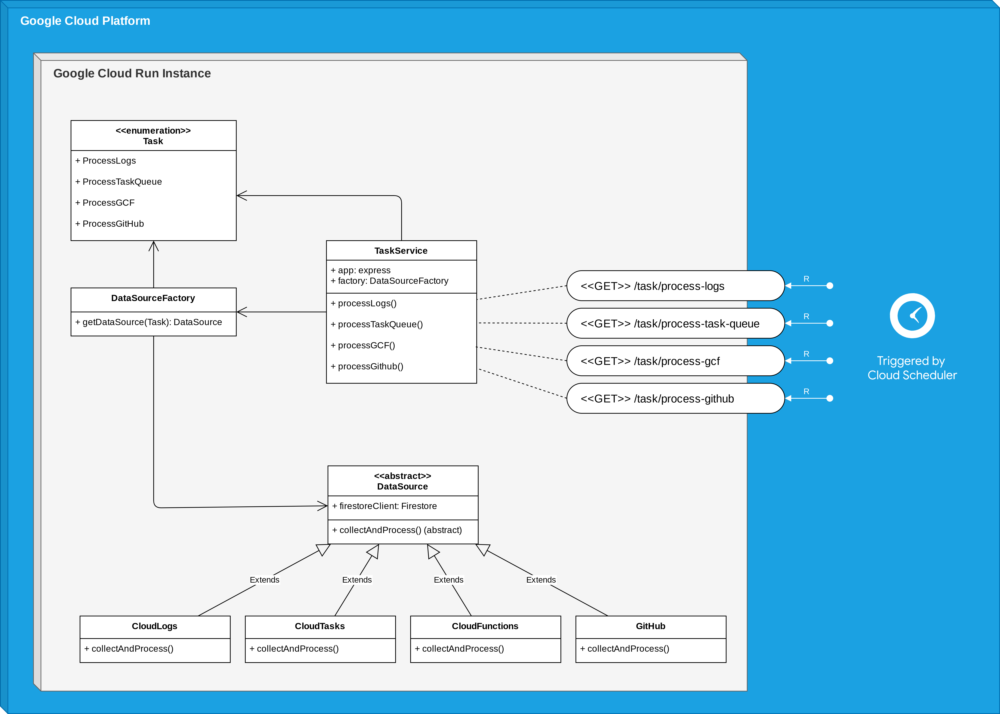
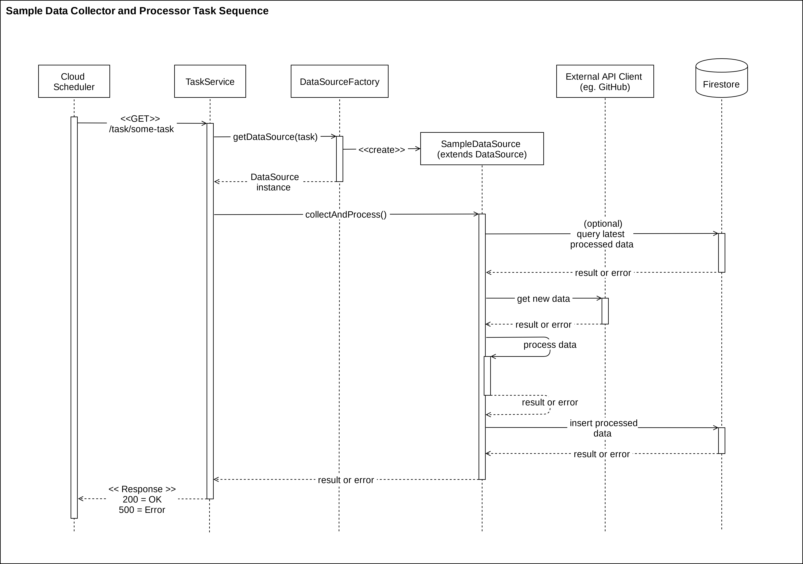

# Data Processor: GitHub Automation Bots Monitoring System

A NodeJS application to continuously consume new data generated by the automation bots as well as other related sources, process it into a standardized format, and store it in Firestore.

## Deployment

Data Processor is currently deployed to a [Cloud Run instance in the repo-automation-bots project](https://console.cloud.google.com/run/detail/us-central1/data-processor/metrics?project=repo-automation-bots). To deploy a new version, install the `gcloud` SDK, authenticate with your account, and run `npm run deploy` from the root directory.

> Note: You will need access to this project as well as deploy privileges on the Cloud Run instance in order to deploy a new version

### Setting up permissions for Data Processor

If you want to use an existing Service Account to give Data Processor access to resources, skip to step 3.

#### Setup a service account for Data Processor

1. Create a GCP Service Account for the Cloud Run instance used by Data Processor by going to GCP Console -> IAM & Admin -> Service Accounts
2. Copy the email address associated with the Service Account you just created
3. Edit the Cloud Run instance used by Data Processor and under Container -> Service Account select the account you just created in step 2 (or an existing account you want to use with Data Processor)

#### Give Data Processor Access to Cloud Tasks

Assign the Data Processor Service Account the IAM permission `cloudtasks.tasks.list` by going to the GCP Console where the task queues live -> IAM & Admin -> IAM

#### Give Data Processor Access to Firestore

Assign the Data Processor Service Account the role `Firebase Develop Admin` in the GCP Console of the Firebase project.

## Development

### Architectural Overview

A class diagram of the Data Processor:

A sequence diagram of a sample processing task:

#### Task Service

An ExpressJS server that exposes endpoints to trigger various processing tasks. Currently, these endpoints are triggered on varying schedules by the [Cloud Scheduler instance in the repo-automation-bots GCP project](https://pantheon.corp.google.com/cloudscheduler?project=repo-automation-bots).

> Note: You will need access to this project to view the Cloud Scheduler jobs

[See the implementation here](src/task-service.ts)

#### Task and Data Processor Factory

The Data Processor Factory returns an appropriate Data Processor for the given task. Currently, there are 4 available data processors that the factory can provide. 

The factory also handles reading the configuration for each of these processors and instantiating them appropriately.

[See the implementation here](src/data-processor-factory.ts)

#### Abstract Data Processor

An abstract class with common functionality required by all data processors (eg. Firestore communication). The primary abstract method `collectAndProcess()` is implemented by sub-classes and is the entry-point to start a processing task.

[See the implementation here](src/data-processors/data-processor-abstract.ts)

#### Cloud Logs Data Processor

Extends the abstract data processor and implements functionality to ingest and process logs coming from repo-automation-bots.

[See the implementation here](src/data-processors/cloud-logs-data-processor.ts)

##### PubSub to route logs

To pipe logs from Cloud Logging to the Cloud Logs Data Processor we create a Cloud Logs sink and configure all logs within the sink to be piped to a [PubSub instance](https://pantheon.corp.google.com/cloudpubsub/topic/detail/repo-automation-bot-logs?project=repo-automation-bots). Cloud Logs Data Processor then pulls the log entries from the PubSub.

#### Cloud Tasks Data Processor

Extends the abstract data processor and implements functionality to poll the task queue status of the bots.

[See the implementation here](src/data-processors/cloud-tasks-data-processor.ts)

#### Cloud Functions Data Processor

Extends the abstract data processor and implements functionality to check the currently deployed bots.

[See the implementation here](src/data-processors/cloud-functions-data-processor.ts)

#### GitHub Data Processor

Extends the abstract data processor and implements functionality to ingest GitHub Events data to be matched with WebHook requests received by the bots.

[See the implementation here](src/data-processors/github-data-processor.ts)

### Firestore Schema

Refer to [firestore-schema.ts](packages/monitoring-system/data-processor/src/firestore-schema.ts) for a guide on the storage schema for Data Processor.

### Add support for a new metric from an existing data source

Depending on the nature of the metric, you will need to do some/all of the following:

1. Make changes to the relevant data processor to process data for that metric
2. Make changes to the Firestore schema (both, the TypeScript module as well as the actual database) to accomodate the new metric
3. Add queries for the new metric to the Metrics Dashboard

### Add support for a new data source

In order to add a new data source for collecting and processing data:

1. Create a new class that extends Abstract Data Processor and implements `collectAndProcess()`
2. Create a new `Task` that corresponds to this data source
3. Modify Data Processor Factory to return a configured instance of your new Data Processor when given this `Task`
4. Expose a new endpoint in `TaskService` that calls Data Processor Factory with the new `Task`
5. Configure Cloud Scheduler to call your new endpoint at the desired interval